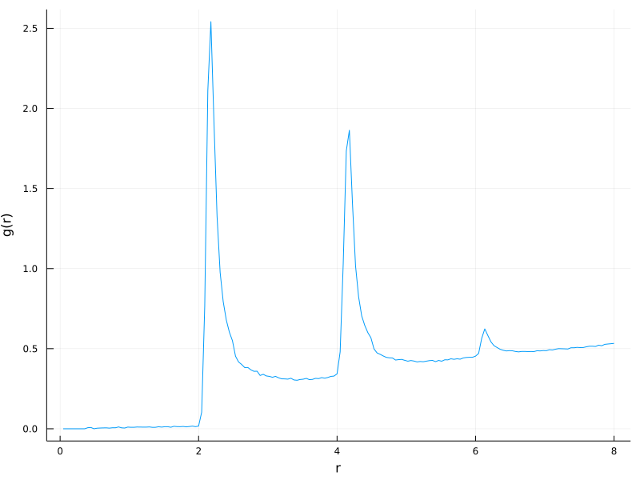

# Radial Distribution Function

A Julia package for calculating a radial distribution function (or pair correlation function) `g(r)`.

The pair correlation function `g(r)` may be defined as the probability density
of finding a particle a distance `r` away from another particle, divided by
the probability density for the same event in a noninteracting system.

## Installation

Add [BoffinStuff](https://github.com/wildart/BoffinStuff) registry in package manager, and proceed installation:

```
pkg> registry add https://github.com/wildart/BoffinStuff.git
pkg> add PairDistribution
```

## Usage

Given a collection of frames with particles coordinates as 3D tensor, e.g. `F`,
and a volume dimensions, e.g. `box`.

```julia
julia> size(F)
(1000, 4, 302)

julia> box
3-element Vector{Float32}:
 34.3141
 34.3141
 34.3141

julia> # calculate g(r) with 100 bins histogram and distances in [0.0,8.0] range.

julia> using PairDistribution

julia> gr, rs = rdf1d(F, box, 100; minmax=[(0.0,8.0)]);

julia> # plot g(r) function

julia> using Plots

julia> plot(rs[1], gr, leg=:none, xlab="r", ylab="g(r)", size=(800,600))
```
